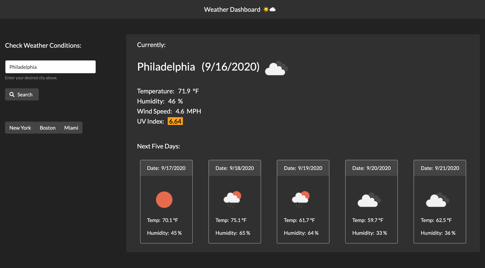

# A Weather Dashboard‎‎‏‏‎ Application ‎‏‏‎ ‎☀☁
--------------
## + Five Day Forecast

&nbsp;

### Project Description:

This is a minimalistic weather dashboard design. This application is a single page interface and allows the user to input a city of their chosing and receive current weather information. Upon searching, the city name, date and an icon representation is presented along with current temperature, humidity, wind speed, and UV index information. The UV index is color coded to provide a visual to the warning levels in that particular location. 0-2 will display green for low risk, 3-5 will display yellow for moderate risk, 5-7 will display orange for medium risk, and anything over 8 will warn you with a red display for high risk. Along with current weather, you will also be able to view the forecast for the next five days and those daily averages for temperature, humidity and an additional icon representation of the conditions. The information is then archived in the form of a previous search button within the same form that the user searched from. If you click a previous result button, you will once again be provided with the same criteria stated above. This information will be stored in local storage, and can be accessed later on for quick searching ability. Current date information is being routed via https://moment.js which is freely distributable under the terms of the MIT license. This weather dashboard was constructed using a single HTML file, a JavaScript file, and a CSS file. I utilized the Bootstrap CDN for row/column layout, jQuery CDN, FontAwesome for icons, and a weather favicon was generated via favic-o-matic. . All weather condition criteria was obtained via Open Weather Map API sources (specifically the Current Weather API and One Call API for UV information and five day forecast.) https://openweathermap.org/api  
 
&nbsp;
&nbsp;

View the application here: https://jonathanschimpf.github.io/A-5-Day-Weather-Dashboard/  

&nbsp;
&nbsp;

----------------------

&nbsp;

&nbsp;

------------------- 
